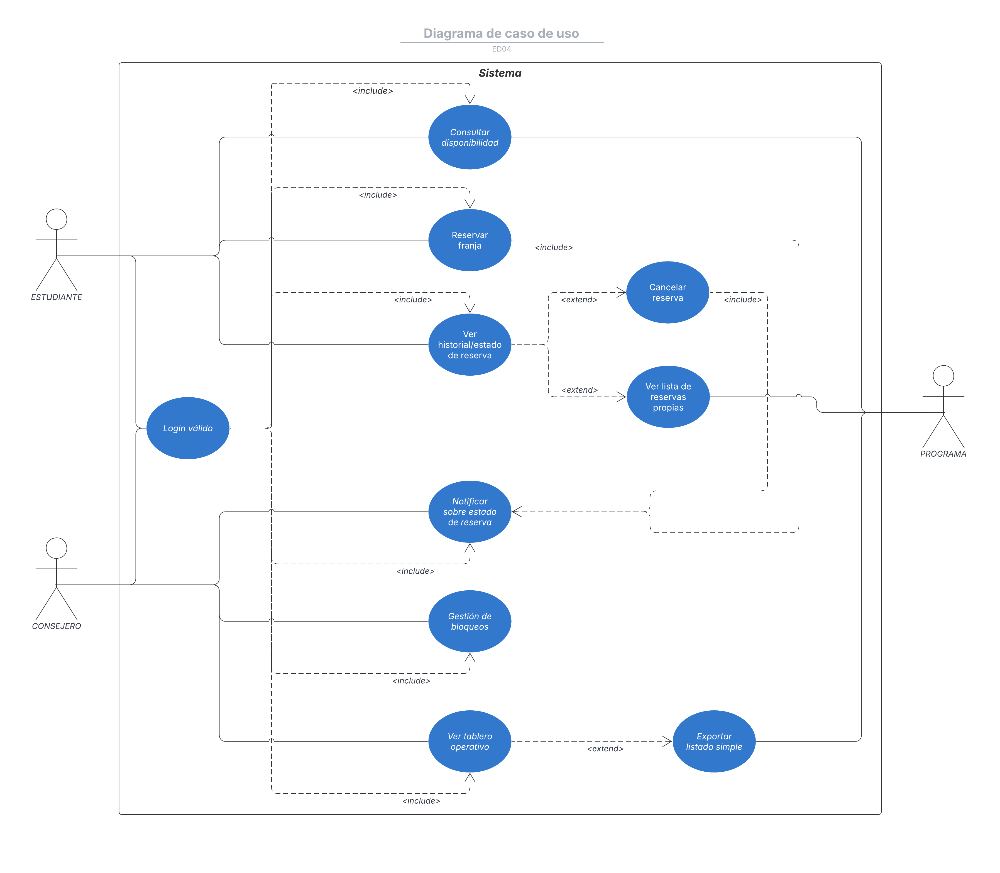

## Documentación de casos de uso
| Caso de uso: Auternticación Institucional   |                                                                                                                             | 
|---------------------------------------------|-----------------------------------------------------------------------------------------------------------------------------|
| ID:                                         | CUS - 01                                                                                                                    |
| Descripción:                                | Permite a los usuarios (Estudiante o Consejero) acceder al sistema validando su correo institucional y un código de acceso. |
| Actor:                                      | Estudiante y Consejero                                                                                                      |
| Precondición:                               | El usuario está en la página de inicio de seesión                                                                           |
| Postcondición                               | El usuario está autenticado y se le carga la interfaz de trabajo (calendario o tablero operativo)                           |

| Flujo principal                                                                                 |
|-------------------------------------------------------------------------------------------------|
| El usuario ingresa su correo electrónico y el código de acceso.                                 |
| El sistema valida las credenciales y el dominio del correo (debe ser institucional).            |
| Si no pertenece a la facultad, el sistema lo cataloga como usuario externo.                     |
| El sistema identifica el rol del usuario (Estudiante o Consejero).                              |
| El sistema confirma el acceso.                                                                  |
| El sistema carga la interfaz correspondiente al rol del usuario.                                |
| El sistema muestra mensaje de acceso con éxito.                                                 |
| El caso de uso termina.                                                                         |
##
| Caso de uso: Consultar disponibilidad |                                                                                                    |
|---------------------------------------|----------------------------------------------------------------------------------------------------|
| ID:                                   | CUS-02                                                                                             |
| Descripción:                          | Muestra al Estudiante un calendario con las franjas horarias disponibles o marcadas como ocupadas. |
| Actor:                                | Estudiante.                                                                                        |
| Precondición:                         | El Estudiante está autenticado.                                                                    | 
| Postcondición:                        | El Estudiante tiene la información sobre la disponibilidad para poder o no realizar una reserva.   |        

| Flujo principal                                                                 |
|---------------------------------------------------------------------------------|
| El Estudiante selecciona una fecha o rango de fechas en la vista de calendario. | 
| El Estudiante consulta por los horarios y los bloqueos.                         |
| El sistema genera las franjas horarias.                                         |
| El sistema marca el estado de cada franja.(Libre u ocupada)                     |
| El sistema muestra las franjas libres y ocupadas.                               |
| El caso de uso finaliza.                                                        |
##
| Caso de uso: Crear reserva |                                                                                                                             |
|----------------------------|-----------------------------------------------------------------------------------------------------------------------------|
| ID:                        | CUS-03                                                                                                                      |
| Descripción:               | El Estudiante solicita y crea una reserva de franja horaria, validando las reglas de negocio (superposición y tope semanal) |
| Actor:                     | El Estudiante                                                                                                               |
| Precondición:              | El estudiante ha verificado una franja libre.                                                                               | 
| Postcondición:             | Se ha creado un nuevo registro de reserva.                                                                                  |

| Flujo principal                                                                                         |
|---------------------------------------------------------------------------------------------------------|
| El Estudiante selecciona una franja horaria libre y confirma la intención de reservar.                  | 
| El Sistema verifica que la franja no esté ocupada y que el Estudiante no haya superado el tope semanal. |
| El Sistema registra la reserva en la base de datos como activa/aprobada.                                |
| El Sistema ejecuta el caso de uso CU-08: Notificar (confirmación al crear).                             |
| El Sistema muestra el mensaje de confirmación de reserva guardada.                                      |
| El caso de uso finaliza.                                                                                |
##
| Caso de uso: Ver historial/estado de reserva |                                                                                                                                                             |
|----------------------------------------------|-------------------------------------------------------------------------------------------------------------------------------------------------------------|
| ID:                                          | CUS_04                                                                                                                                                      |
| Descripción:                                 | Permite al Estudiante ver el estado de su reserva y tiene la posibilidad de cancelarla, respetando la política de cancelación. (tiempo mínimo configurable) |
| Actor:                                       | Estudiante.                                                                                                                                                 |
| Precondición:                                | El estudiante está autenticado y tiene reservas.                                                                                                            | 
| Postcondición:                               | Si cancela una reserva, el estado de la reserva pasa a "Cancelada", se libera una franja y se notifica el hecho.                                            |        

| Flujo principal                                                                                              |
|--------------------------------------------------------------------------------------------------------------|
| El Estudiante navega a la sección "Mis Reservas".                                                            |
| El sistema muestra el listado de reservas propias (activas, pasadas).                                        |
| El Estudiante selecciona una reserva activa y confirma la cancelación.                                       |
| El sistema verifica el tiempo restante para el inicio contra la política de cancelación (ej. $\ge N$ horas). |
| Si cumple el plazo: El sistema actualiza el estado de la reserva a "Cancelada".                              |
| El sistema le avisa al usuario que ha cancelado su reserva.                                                  |
| El caso de uso finaliza.                                                                                     |
##
| Caso de uso: Administrar Bloqueos |                                                                                                                              |
|-----------------------------------|------------------------------------------------------------------------------------------------------------------------------|
| ID:                               | CUS-05                                                                                                                       |
| Descripción:                      | Permite al Consejero gestionar (CRUD) periodos de bloqueo en el calendario (mantenimiento o eventos) que impidan la reserva. |
| Actor:                            | Consejero.                                                                                                                   |
| Precondición:                     | El Consejero está autenticado.                                                                                               | 
| Postcondición:                    | El bloqueo está registrado y se muestra como franja ocupada en CUS-02                                                        |        

| Flujo principal                                                                                  |
|--------------------------------------------------------------------------------------------------|
| El Consejero accede al módulo de Bloqueo de Calendarios.                                         |
| El Consejero selecciona la fecha a bloquear y define el horario del bloqueo.                     |
| El Consejero confirma el bloqueo.                                                                |
| El sistema registra el bloqueo y le da prioridad respecto a toda reserva que se quiera realizar. |
| El caso de uso finaliza.                                                                         |
##
| Caso de uso: Ver Tablero Operativo |                                                                                                                        |
|------------------------------------|------------------------------------------------------------------------------------------------------------------------|
| ID:                                | CUS-06                                                                                                                 |
| Descripción:                       | Muestra al consejero el listado operativo de reservas ordenado de Lunes a Jueves, con filtros para la gestión semanal. |
| Actor:                             | Consejero.                                                                                                             |
| Precondición:                      | El Consejero está autenticado.                                                                                         | 
| Postcondición:                     | El Consejero tiene acceso a la información operativa.                                                                  |

| Flujo principal                                                                                                                          |
|------------------------------------------------------------------------------------------------------------------------------------------|
| El consejero accede a el módulo Ver Tablero Operativo".                                                                                  |
| El sistema le muestra la lista de reservas por semana, ordenadas de Lunes a Sábado.                                                      |
| El sistema le permite al Consejero aplicar filtros básicos a la lista de reservas presentada o hacer una exportación simple del listado. |
| El sistema aplica el filtro o exporta el listado, si se ha escogido alguna de esas opciones.                                             |
| El caso de uso finaliza.                                                                                                                 |
##
| Caso de uso: Notificar al Usuario  |                                                                                        |
|------------------------------------|----------------------------------------------------------------------------------------|
| ID:                                | CUS-07                                                                                 |
| Descripción:                       | Permite al consejero notificar al usuario el estado en el que se encuentra su reserva. |
| Actor:                             | Consejero.                                                                             |
| Precondición:                      | El Consejero está autenticado.                                                         | 
| Postcondición:                     | Se le ha enviado un correo informativo o de aviso al Estudiante.                       |        

| Flujo principal                                                                                                                               |
|-----------------------------------------------------------------------------------------------------------------------------------------------|
| El Consejero accede al módulo de Notificar.                                                                                                   |
| El sistema le muestra la posiblidad de notificar sobre algún cambio que hubo en los horarios al registrar la reserva.                         |
| El sistema le muestra la posibilidad de realizar un informe respecto a la cancelación o el rechazo de la reserva realizada por el Estudiante. |
| El Consejero envia un correo al Estudiante respecto a los datos de la reserva.                                                                |
| El caso de uso finaliza.                                                                                                                      |

## Diagrama de casos de uso
