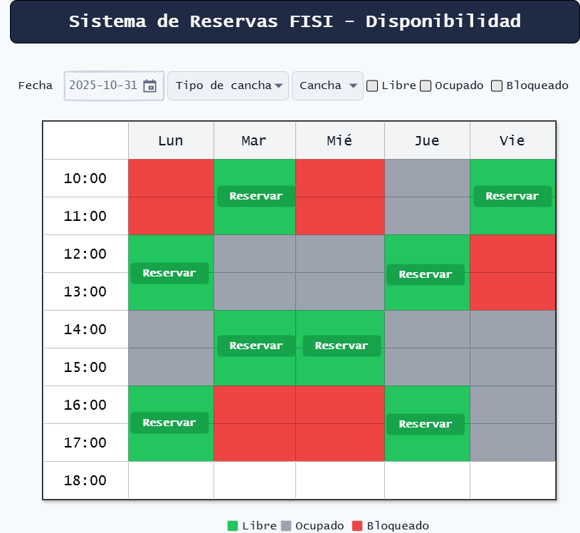
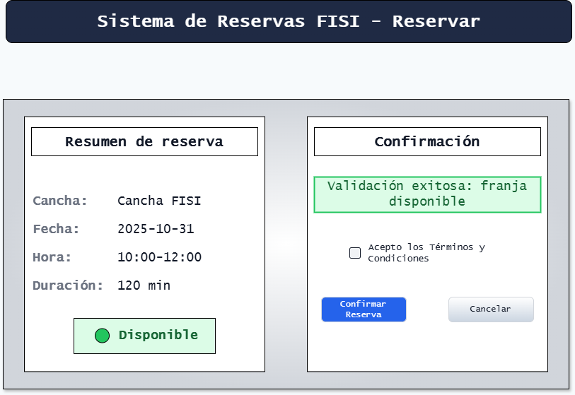

# Interfaces de Usuario (Mockups) — Fase 02
Proyecto: **Sistema de Reservas FISI** · Facultad FISI · UNMSM

> Entrega solicitada por la guía: **2–3 mockups** en formato **.png/.jpg**.  
> Carpeta sugerida para imágenes: `project/fase02/mockups/`.

## 1) Disponibilidad (RU-01 → RF-01 → CP-01/CP-02)
Pantalla principal para consultar la disponibilidad por fecha/cancha aplicando **reglas** y **bloqueos**.
- Filtros: Fecha, Tipo de cancha, Cancha, Estado (Libre/Ocupado/Bloqueado).
- Calendario/tabla de franjas (10:00–18:00 ejemplo) con **colores**:
  - **Verde** = Libre, **Gris** = Ocupado, **Rojo** = Bloqueado.
- Acción en franja libre: **Reservar**.
- Leyenda de colores y nota: “Los bloqueos tienen prioridad sobre las reservas”.

**Mockup:**  

---

## 2) Reservar / Confirmación — Disponible (RU-02 → RF-02 → CP-03/CP-09)
Pantalla de confirmación cuando la franja está disponible.
- Resumen: Cancha, Fecha, Hora, Duración.
- Validación **OK** (banner verde).
- **Términos y Condiciones** (checkbox).
- Botones: **Confirmar reserva** (primario) y **Cancelar**.
- Mensaje de éxito: “Reserva confirmada (CP-09)”.

**Mockup:**  

### 2b) Reservar / Confirmación — Error (tope o bloqueo) (RU-02/07/06 → RF-02/05/04 → CP-04/CP-05/CP-15)
Mismo layout, pero con validación **ERROR** (banner rojo) por:
- **Bloqueo**

